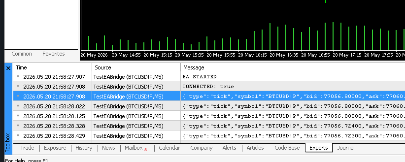
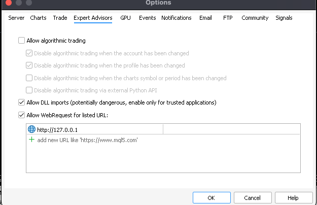

# EA Bridge POC

This is a basic POC (proof of concept) for creating a MT5's EA based socket connection with the node js server
for live feeds from mt5. For e.g. live ticks, live transaction updates etc

## How to use this POC
This poc contains two folders: 
1. backend
2. mt5ea

backend folder contains the server code that can be run using the command
```bash
    npm run dev
```

* make sure to install the node modules first via below command
```bash
    cd backend
    npm i
```

The server will start listening on 127.0.0.1 ip on port 5555

Next, the mt5ea folder contains the expert advisor code that will create the socket on mt5 side to connect.
To use this EA you can copy the ea and compile it in MT5's IDE. After that attached the compiled EA to any chart on mt5.

See the logs of the EA in Experts tab, it should print CONNECTED



Incase you get ERROR 4014 then go to Tools>options and check the Allow WebRequest for listed URL: whitelist the url http://127.0.0.1



And re-run the EA, it will start sending the live ticks to the node server.
